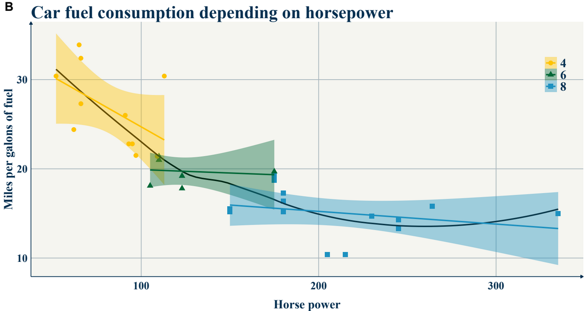
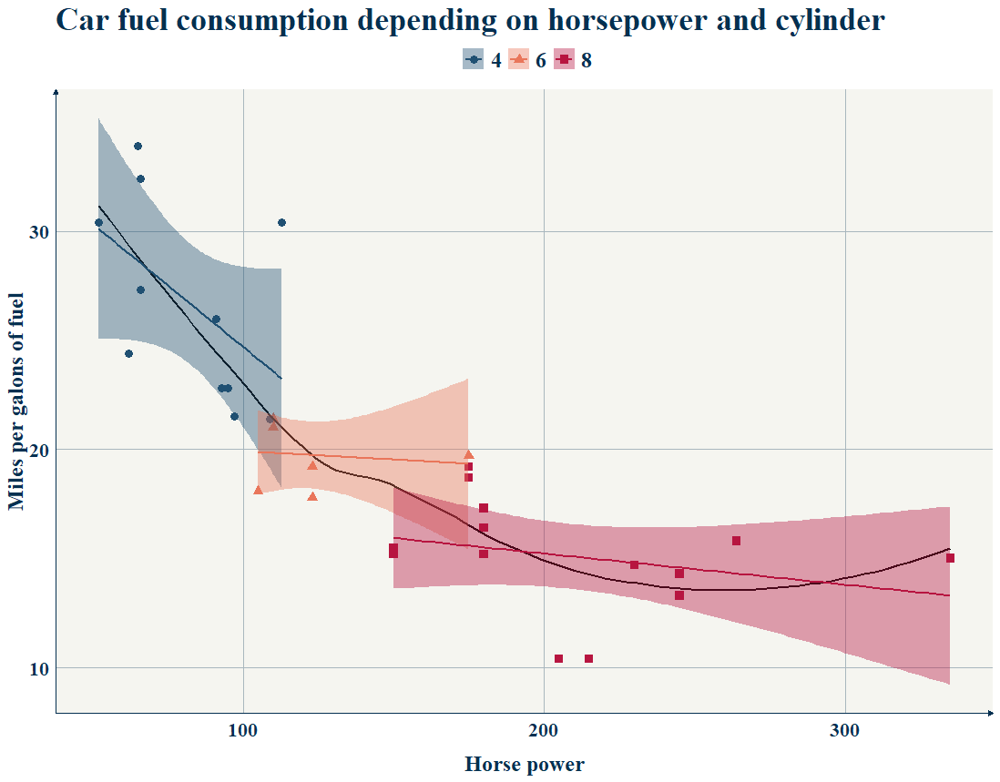
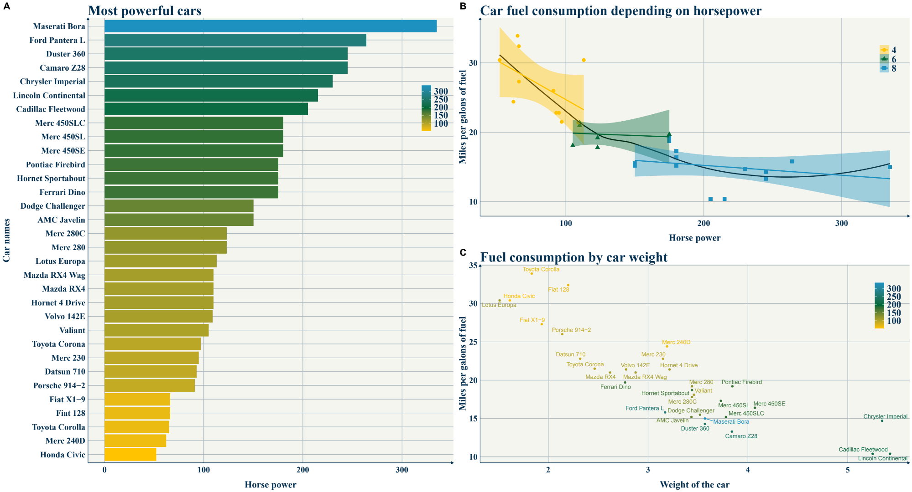
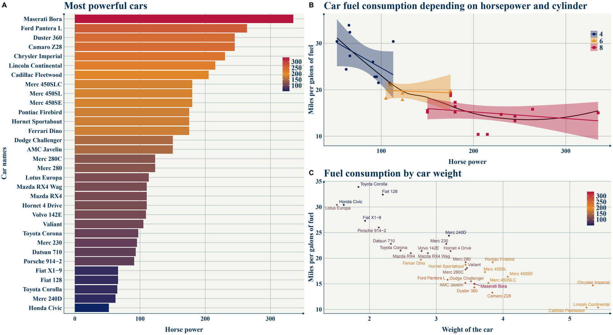
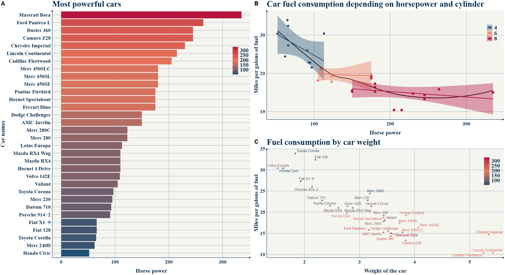

## Hello everyone, 

In this post I wish to share with you a **function** that introduces a theme for a more appealing design of all the **objects** and graphs made with the **package ggplot2** on R. 
The package ggplot2 is very useful for displaying the data contained in .csv files or data tables into a beautiful graphic/plot that is easier to understand for us human, than raw numbers.

Displaying the data correctly is essential, and appropriate graph for the correct data types will benefit the readers and anyone who look at our graph. 

In this post, I will not talk about the ways to visualize data, but rather explain how can we make our ggplot2 graphs/plots more beautiful.  

### 1. Installing ggplot2

On the R studio interface, in the console (bottom left panel), you can type the following lines:

``` 
install.packages("ggplot2")   #install the package
library(ggplot2)              #start the package on the session
```
<br>

### 2. Loading the theme function() in the R environment

In order to access to use the function, you can load it into the environment using the following code: 

  [The R code]("https://qwentee.netlify.app/project/my-ggplot-theme/Qwentheme_Rcode.R")

*(I might create a package for the theme in a near future)*

<br>

### 3. using the theme on your graphs   

To use it on any ggplot, once the function is loaded, you can add the following argument to your ggplot

> ggplot() + theme_qwen()

If you wish to edit the look of the theme, I advise that for you add for each graph your customs theme arguments **After** +theme_qwen()

For instance if you want to change the size from 26 to 22 for the plot title:

> ggplot() + theme_qwen() + theme(plot.title = element_text(size=22))

<br>

### 4. Adding colors

By adding **color=X** or **fill=Y** in the aesthetics aes of a plot, you can control the colors using either:

> + +Scale_fill_manual(values = *color_palette_name* ) 
> + +scale_color_manual(values = *color_palette_name* )


For qwen_theme, I like those tricolor palettes: <br>


- **Yellow Green Blue**
```
colorsYGB <- c("#FFC300", "#006837", "#1D91C0" )
```



- **Blue Yellow Red (+light alternative)** 
```
colors_fr <- c("#0c2461", "#e58e26", "#b71540")
```


- **Blue Yellow Red (light)** 

```
colors_fr_light <- c("#205072", "#E9765B", "#b71540")
```



### Showcase

<br>



<br>



<br>



## Enjoy!